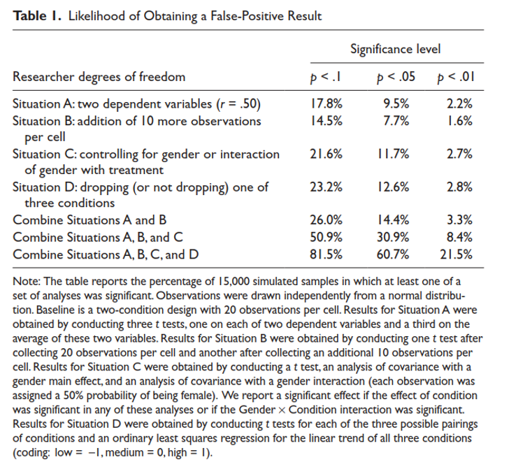
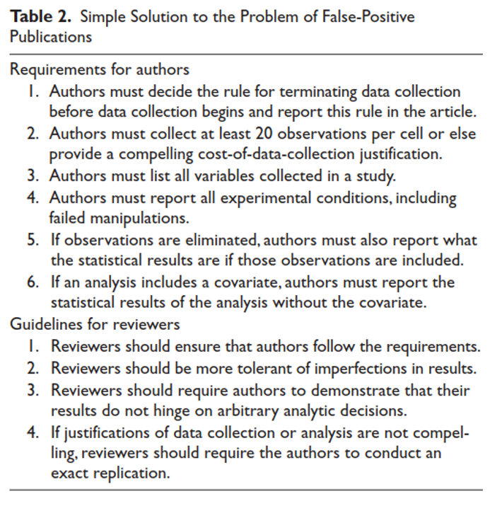

```{r}
#| echo: false
#| message: false

library(tidyverse)
options(scipen = 999) # turns off scientific notation
options(knitr.kable.NA = '')
```

--------------------------------------------------------------------------------

## The Decision Matrix

<!-- To highlight, add class="hl" (color fill):
       - whole row:    on the <tr>
       - whole column: on each cell (<th>/<td>) in that column -->

<table>
<thead>
<tr>
  <th></th>
  <th>No Effect</th>
  <th>Effect Exists</th>
</tr>
</thead>
<tbody>
<tr>
  <td><strong>Fail to Reject Null</strong></td>
  <td><span style="color:forestgreen;">Correct (True Negative, TN)</span></td>
  <td><span style="color:red;">Type II Error (False Negative, FN)</span></td>
</tr>
<tr>
  <td><strong>Reject Null</strong></td>
  <td><span style="color:red;">Type I Error (False Positive, FP)</span></td>
  <td><span style="color:forestgreen;">Correct (True Positive, TP)</span></td>
</tr>
</tbody>
</table>

#### Understanding the Matrix {style="margin-top: 3rem; color: #c5050c;"}

- Columns define reality (is there a true effect in the population of scores)
- Rows define the researchers' decision based on the statistical analysis (Reject vs. Fail to Reject)

<br>

- Cells colored in green are correct decisions
- Cells colored in red are errors

<br>

- Also called confusion matrix in machine learning context 

<!--other options for spacing are <div style="height: 1.5rem;"></div> or <br>-->

--------------------------------------------------------------------------------

## The Decision Matrix

<table>
<thead>
<tr>
  <th></th>
  <th>No Effect</th>
  <th>Effect Exists</th>
</tr>
</thead>
<tbody>
<tr>
  <td><strong>Fail to Reject Null</strong></td>
  <td><span style="color:forestgreen;">Correct (True Negative, TN)</span></td>
  <td><span style="color:red;">Type II Error (False Negative, FN)</span></td>
</tr>
<tr>
  <td><strong>Reject Null</strong></td>
  <td><span style="color:red;">Type I Error (False Positive, FP)</span></td>
  <td><span style="color:forestgreen;">Correct (True Positive, TP)</span></td>
</tr>
</tbody>
</table>

#### Statistical Validity Requires: {style="margin-top: 3rem; color: #c5050c;"}

- Nominal control of Type 1 error rate at specified value
- High statistical power
- Low false discovery rate

--------------------------------------------------------------------------------

## The Decision Matrix - Type 1 Error Rate

<table>
<thead>
<tr>
  <th></th>
  <th class="hl">No Effect</th>
  <th>Effect Exists</th>
</tr>
</thead>
<tbody>
<tr>
  <td><strong>Fail to Reject Null</strong></td>
  <td class="hl"><span style="color:forestgreen;">Correct (True Negative, TN)</span></td>
  <td><span style="color:red;">Type II Error (False Negative, FN)</span></td>
</tr>
<tr>
  <td><strong>Reject Null</strong></td>
  <td class="hl"><span style="color:red;">Type I Error (False Positive, FP)</span></td>
  <td><span style="color:forestgreen;">Correct (True Positive, TP)</span></td>
</tr>
</tbody>
</table>

#### Type 1 Error Rate: {style="margin-top: 3rem; color: #c5050c;"}

- This is the probability that you will reject the NULL hypothesis when it is TRUE (this is an error)
- Also called False Alarm Rate [Its inverse is called Specificity in machine learning]

 <br>
 
- FP / (FP + TN)

<br> 

- Controlled by choice for alpha ($\alpha$; true only under assumptions for statistical test)
- Can be simulated when assumptions are violated
- We typically focus on *test-wise* Type 1 error rate but should consider *family-wise* Type 1 error as well

--------------------------------------------------------------------------------

## The Decision Matrix - Statistical Power

<table>
<thead>
<tr>
  <th></th>
  <th>No Effect</th>
  <th class="hl">Effect Exists</th>
</tr>
</thead>
<tbody>
<tr>
  <td><strong>Fail to Reject Null</strong></td>
  <td><span style="color:forestgreen;">Correct (True Negative, TN)</span></td>
  <td class="hl"><span style="color:red;">Type II Error (False Negative, FN)</span></td>
</tr>
<tr>
  <td><strong>Reject Null</strong></td>
  <td><span style="color:red;">Type I Error (False Positive, FP)</span></td>
  <td class="hl"><span style="color:forestgreen;">Correct (True Positive, TP)</span></td>
</tr>
</tbody>
</table>


#### Statistical Power: {style="margin-top: 3rem; color: #c5050c;"}

- This is the probability that you will reject the NULL hypothesis when it is FALSE (this is a correct decision)
- The inverse is the Type II error rate
- [Also called Sensitivity]

<br>
- TP / (TP + FN)

<br>

- Impacted by many factors (next slides) but can be simulated

--------------------------------------------------------------------------------


## What Determines Power?

<br>

Some statistical tests are more powerful (i.e., better at detecting real/non-zero population effects) than others.     

- Parametric tests often are more powerful than non-parametric, because they work with more information from the data.  

- GLM is MVUE (Minimum Variance Unbiased Estimators) when assumptions are met.   

--------------------------------------------------------------------------------


## What Factors Affect Power in GLM?

- **Alpha ($\alpha$)**: As alpha increases (e.g., goes from .01 to .05), power increases.  As alpha increases:
  - Larger rejection region in sampling distribution for $b$ given $H_0$

- **Sample size**: As $N$ increases, power increases. As $N$ increases:
  - $SE_b$ decreases 
  - Narrower sampling distribution for $b$, so $b is more extreme (in tail)
  - $t$ statistic will be larger

- **Magnitude of effect in the population**: As magnitude of the effect in the population increases (e.g., bigger $\beta$), power increases.  As $b$ increases:
  – $b$ will be more extreme (in tail) in sampling distribution for $b$ 
  - $t$ statistic will be larger

::: {.footer}
Additional factors on next slide
:::

--------------------------------------------------------------------------------

## What Factors Affect Power in GLM (continued)?

- **Number of parameters in augmented model**: As $P_a$ increases (i.e., augmented model gets more complex/more $X$), power decreases. As $P_a$ increases:
  - $SE_b$ increases 
  - Wider sampling distribution for $b$ (so $b$ is less extreme)
  - $t$ statistic will be smaller

- **Number of parameters in effect (multi-parameter comparisons)**: As $P_a - P_c$ increases, power decreases. As $P_a - P_c$ increases:
  - Sampling distribution for $F$ gets wider (we don't see this directly from model results), so F less extreme (with smaller p-value)
  
- **Error (unexplained variance in $Y$)**:  As $SSE_a$ increases (and model $R^2$ decreases), power decreases.  As $SSE_a$ increases:
  – $SE_b$ increases 
  - $b$ will be less extreme in sampling distribution for $b$
  - $t$ statistic will be smaller

--------------------------------------------------------------------------------

## Power Conventions

Desired level of power: 

- Depends on purpose, but usually the more the better 
- The value of .80 has become a minimum threshold standard (much like alpha = .05 for significance testing.   
- Higher power also means more precision in estimating the magnitude of the effect (narrower CI).   

--------------------------------------------------------------------------------

## Problems from Low Power

1. Low probability of finding true effects.   
2. High false discovery rate 
3. An exaggerated estimate of the magnitude of the effect when a true effect is discovered. 

--------------------------------------------------------------------------------

## Missed True Effects

Low power, by definition, means that the chance of discovering effects that are genuinely true is low.   

If a study has 20% power and there really is an effect, you only have a 20% chance of finding it.  

Low-powered studies produce more false negatives (misses) than high-powered studies.   

We tend to focus on false alarms, but misses can be equally costly (e.g., new treatments).   

You waste resources (time, money) with low-powered studies. One high-powered study (N) > Two low-powered studies (N/2).

--------------------------------------------------------------------------------

## High False Discovery Rate 

The lower the power of a study, the higher the probability that an observed **significant** effect (among the set of all significant effects) reflects a false alarm (error) vs  a true non-zero effect in the population. 

- When a significant effect reported in the literature is wrong (the true population effect is NULL), it is called a **False Discovery** and the likelihood of this happening is called the False Discovery Rate.  

- It is NOT equal to alpha (which is a column probability in confusion matrix).  It is a row probability in the confusion matrix (more on this in a moment).

- The inverse of the FDR is called the positive predictive value of a claimed discovery (mostly from machine learning)

--------------------------------------------------------------------------------

## The Decision Matrix - False Discovery Rate

<table>
<thead>
<tr>
  <th></th>
  <th>No Effect</th>
  <th>Effect Exists</th>
</tr>
</thead>
<tbody>
<tr>
  <td><strong>Fail to Reject Null</strong></td>
  <td><span style="color:forestgreen;">Correct (True Negative, TN)</span></td>
  <td><span style="color:red;">Type II Error (False Negative, FN)</span></td>
</tr>
<tr class="hl">
  <td><strong>Reject Null</strong></td>
  <td><span style="color:red;">Type I Error (False Positive, FP)</span></td>
  <td><span style="color:forestgreen;">Correct (True Positive, TP)</span></td>
</tr>
</tbody>
</table>


--------------------------------------------------------------------------------

$\text{PPV} = \frac{(1 - \beta) * \text{OR}}{(1 - \beta) * \text{OR} + \alpha}$   

Where:    

- $(1 - \beta)$ is the power.   
- $\beta$ is the type II error rate.   
- $\alpha$ is the type I error rate.
- $\text{Odds}$ is the pre-study odds that an effect is indeed non-null among the effects being tested in a field or other set.

Formula can be rewritten as:   

- $\text{PPV} = \frac{\text{Power * Odds}}{\text{Power * Odds} + \alpha}$

--------------------------------------------------------------------------------

A priori odds that effect exists: Odds = 1 (p = .5)  
Power: 80%   
Simulate: 200 studies   

- $\text{PPV} = \frac{(1 - \beta) * \text{Odds}}{(1 - \beta) * \text{Odss} + \alpha}$    
- $\text{PPV} = \frac{(1 - .20) *1}{(1 - .20) * 1 + .05} = \frac{.80}{.85} = .94$   

```{r}
#| echo: false

tibble("Research Concludes" = c("FAIL TO REJECT NULL; NO EFFECT", 
                                "REJECT NULL; EFFECT EXISTS", " "),
       "NO EFFECT" = c("CORRECT FTR; <b>95</b>", 
                       "TYPE I ERROR; <b>5</b>",
                       "<b>100</b>"),
       "EFFECT EXISTS" = c("TYPE II ERROR; <b>20</b>",
                           "CORRECT R; <b>80</b>",
                           "<b>100</b>")) |> 
  kableExtra::kbl(escape = FALSE) |> 
  kableExtra::column_spec(1, bold = TRUE) |>
  kableExtra::add_header_above(c(" ", "Reality" = 2)) |> 
  kableExtra::row_spec(2, background = "yellow")
```

--------------------------------------------------------------------------------

A priori odds that effect exists: 1 (p = .5)  
Power: 20%   
Simulate: 200 studies   

- $\text{PPV} = \frac{(1 - \beta) * \text{OR}}{(1 - \beta) * \text{OR} + \alpha}$    
- $\text{PPV} = \frac{(1 - .80) *1}{(1 - .80) * 1 + .05} = \frac{.20}{.25} = .80$   

```{r}
#| echo: false

tibble("Research Concludes" = c("FAIL TO REJECT NULL; NO EFFECT", 
                                "REJECT NULL; EFFECT EXISTS", " "),
       "NO EFFECT" = c("CORRECT FTR; <b>95</b>", 
                       "TYPE I ERROR; <b>5</b>",
                       "<b>100</b>"),
       "EFFECT EXISTS" = c("TYPE II ERROR; <b>80</b>",
                           "CORRECT R; <b>20</b>",
                           "<b>100</b>")) |> 
  kableExtra::kbl(escape = FALSE) |> 
  kableExtra::column_spec(1, bold = TRUE) |>
  kableExtra::add_header_above(c(" ", "Reality" = 2)) |> 
  kableExtra::row_spec(2, background = "yellow")
```

--------------------------------------------------------------------------------

A priori odds that effect exists: .25 (p = .2)  
Power: 20%   
Simulate: 200 studies   

- $\text{PPV} = \frac{(1 - \beta) * \text{Odds}}{(1 - \beta) * \text{Odds} + \alpha}$    
- $\text{PPV} = \frac{(1 - .80) *.25}{(1 - .80) * .25 + .05} = \frac{.05}{.10} = .50$   

```{r}
#| echo: false

tibble("Research Concludes" = c("FAIL TO REJECT NULL; NO EFFECT", 
                                "REJECT NULL; EFFECT EXISTS", " "),
       "NO EFFECT" = c("CORRECT FTR; <b>152</b>", 
                       "TYPE I ERROR; <b>8</b>",
                       "<b>160</b>"),
       "EFFECT EXISTS" = c("TYPE II ERROR; <b>32</b>",
                           "CORRECT R; <b>8</b>",
                           "<b>40</b>")) |> 
  kableExtra::kbl(escape = FALSE) |> 
  kableExtra::column_spec(1, bold = TRUE) |>
  kableExtra::add_header_above(c(" ", "Reality" = 2)) |> 
  kableExtra::row_spec(2, background = "yellow")
```

--------------------------------------------------------------------------------

## What does this imply about papers in Science?


--------------------------------------------------------------------------------
  
## Sample Estimate of Effect is Too Large

When an under-powered study discovers a true effect (i.e., finds effect signficant), it is likely that the estimate of the magnitude of that effect provided by that study will be exaggerated.    

Effect inflation is worst for small, low-powered studies, which can only detect sample parameter estimates effects that happen to be large.    

::: {.callout-important}
# Question
Why does this make sense?
:::

::: {.fragment}
Consider an example where $\beta = 5, SE = 4$. Draw sampling distribution. Indicate region where sample $b$s would be significant. What can we conclude about estimates ($b$) for $\beta$ in any one study or across a bunch of studies?
:::

--------------------------------------------------------------------------------

## Other Biases That Often Come With Low Power

1. Vibration of effects.
2. Publication bias, selective data analysis, and selective reporting of outcomes.
3. May be of lower quality in other aspects of their design.

--------------------------------------------------------------------------------

## Vibration of Effects

**Vibration of effects** refers to the situation in which a study obtains different estimates of the magnitude of the effect depending on the analytical options it implements.   

These options could include the statistical model, the definition of the variables of interest, the use (or not) of adjustments for certain potential confounders but not others, the use of filters to include or exclude specific observations and so on.    

This is more often the case for small studies.    

Results can vary markedly depending on the analysis strategy when power is low because of small N.

--------------------------------------------------------------------------------

## Publication Bias and Selective Reporting

Publication bias and selective reporting of outcomes and analyses are more likely to affect smaller, under-powered studies.   

Smaller studies “disappear” into a file drawer (larger studies are known and anticipated).     

Larger null results may be published because low power isn't a viable explanation for null effect.

The protocols of large (clinical) studies are more likely to have been registered or otherwise made publicly available. Deviations in the analysis plan and choice of outcomes may be more obvious.   

Smaller studies may have a worse design quality than larger studies.    

Small studies may be opportunistic, quick and dirty experiments. Data collection and analysis may have been conducted with little planning.      

Large studies often require more funding and personnel resources. Designs are examined more carefully before data collection, and analysis and reporting may be more structured.    

--------------------------------------------------------------------------------

Simmons, J. P., Nelson, L. D., & Simonsohn, U. (2011). False-positive psychology: Undisclosed flexibility in data collection and analysis allows presenting anything as significant. Psychological Science, 22(11), 1359–1366.





--------------------------------------------------------------------------------

Simmons, J. P., Nelson, L. D., & Simonsohn, U. (2011). False-positive psychology: Undisclosed flexibility in data collection and analysis allows presenting anything as significant. Psychological Science, 22(11), 1359–1366.


--------------------------------------------------------------------------------

Simmons, J. P., Nelson, L. D., & Simonsohn, U. (2011). False-positive psychology: Undisclosed flexibility in data collection and analysis allows presenting anything as significant. Psychological Science, 22(11), 1359–1366.



--------------------------------------------------------------------------------

Simmons, J. P., Nelson, L. D., & Simonsohn, U. (2011). False-positive psychology: Undisclosed flexibility in data collection and analysis allows presenting anything as significant. Psychological Science, 22(11), 1359–1366.


--------------------------------------------------------------------------------

## The 21 Word Solution

Simmons, J. P., Nelson, L. D., & Simonsohn, U. (2012). A 21 word solution. Retrieved from: [http://dx.doi.org/10.2139/ssrn.2160588](http://dx.doi.org/10.2139/ssrn.2160588)   

We have adopted the recommendation to report 

- how we determined our sample size
- all data exclusions
- all manipulations
- all study measures. 

We will include the following brief (21 word) statement in all papers we submit for publication:      

"We report how we determined our sample size, all data exclusions (if any), all manipulations, and all measures in the study.”

--------------------------------------------------------------------------------

## Power Analysis Strategies

There are two general strategies for power analyses

1. A priori: Determine number of subjects needed ($N$) for given level of power (e.g. .80).  Used to determine sample size for pending study.

2. Post hoc: Determine power for a given design (e.g., completed experiment with fixed $N$).   

You should almost always do (and report) an a priori power analysis (maybe not if no control over $N$?)

::: {.callout-important}
# Question
When will you do a post hoc power analysis?
:::

::: {.fragment}
When you do not find a hypothesized effect to be significant.  Can reduce concern that this is a type II error.
:::


--------------------------------------------------------------------------------

## Power Simulations 


--------------------------------------------------------------------------------

## Example 1: Two group design

All simulations done in Tidyverse ecosystem

- Kept simple here for understanding
- Can expand to use parallel processing with `foreach`

```{r}
#| message: false
#| warning: false

library(tidyverse)
```

--------------------------------------------------------------------------------

## Example 1: Two group design


Start by writing function for data generating process

- Equal N in two groups
- GLM assumptions met (independent observations, residuals normally distributed with mean of 0 and constant variance)
- Can specify the sample size (`n`) and size of X effect (`b`)

```{r}
get_data <- function(n, b){
  x <- rep(c(0,1), n/2)
  # y = b0 + b1*x + e  
  y <- 0 + b*x + rnorm(n = n, mean = 0, sd = 10)
  tibble(x = x, y = y)
}
```

Simple test/demonstration
```{r}
d <- get_data(10, 5)

d
```


--------------------------------------------------------------------------------

## Example 1: Two group design

Write function to fit the analysis model

- Added benefit - precise preregistration of analysis

```{r}
fit_model <- function(data){
  lm(y ~ x, data = data)
}
```


extract_stats <- function(model){
  results <- summary(model)
  b <- results$coefficients["x", "Estimate"] 
  p <- results$coefficients["x", "Pr(>|t|)"] 
  sig <- if_else(p < .05, 1, 0) 
  tibble(b, p, sig)
}


# single run
d <- get_data(100, 5)
d |> glimpse()

m <- fit_model(data)
summary(m)

extract_stats(m)

# set up sims 
n_sims <- 1000
b <- 5
n <- c(40, 80, 120, 160)

sims <- expand_grid(b = b, n = n, n_sim = 1:n_sims)
nrow(sims)
head(sims)
tail(sims)

sims <- sims |> 
  mutate(model_b = NA,
         model_p = NA,
         model_sig = NA)

head(sims)


# run the sims
set.seed(12345)
for (i in 1:nrow(sims)){
 
  d <- get_data(sims$n[i], sims$b[i])
  m <- fit_model(d)
  stats <- extract_stats(m) 
  sims$model_b[i] <- stats$b
  sims$model_p[i] <- stats$p
  sims$model_sig[i] <- stats$sig
  
}


sims |> 
  summarise(power = mean(model_sig), .by = n) |> 
  ggplot(aes(x = n, y = power)) +
  geom_line() +
  geom_point() +
  labs(x = "Sample size (n)", y = "Power") +
  theme_minimal()


# plot estimated power (mean of model_sig) by n
sims |> 
  summarise(power = mean(model_sig), .by = n) |> 
  ggplot(aes(x = n, y = power)) +
  geom_line() +
  geom_point() +
  labs(x = "Sample size (n)", y = "Power (P(significant))")


# The tidyverse way...

sims <- sims |> 
  mutate(data = map2(n, b, 
                     \(n, b) get_data(n, b)),
         model = map(data, 
                     \(data) fit_model(data)))

